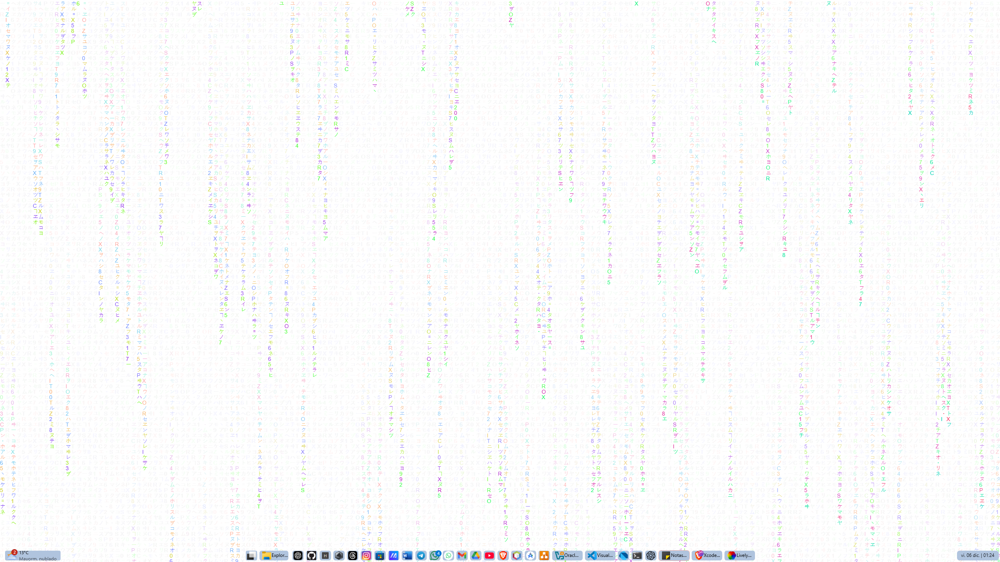

# matrix
Matrix like animation using HTML5 Canvas. Inspired from [sample code](http://thecodeplayer.com/walkthrough/matrix-rain-animation-html5-canvas-javascript) on [thecodeplayer.com](http://thecodeplayer.com/).

See it in action @ http://parambirs.github.io/matrix

<<<<<<< HEAD
@ 2020-09-05 - added lively customizable options (rainbow / color select) - khuong

**Customization test**

=======
@ 2020-09-05 - added lively customizable options (rainbow / color select) - khuong
>>>>>>> 4abb87ed72ecf88d48da4543098489a2cc740800
